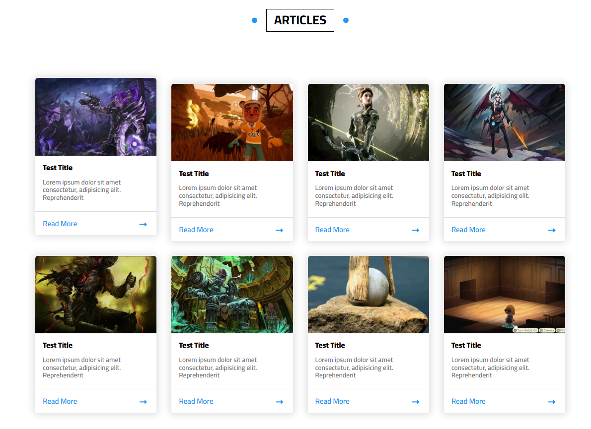
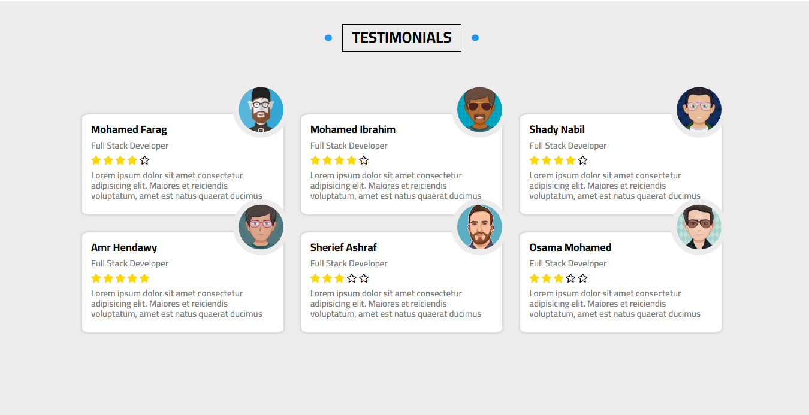
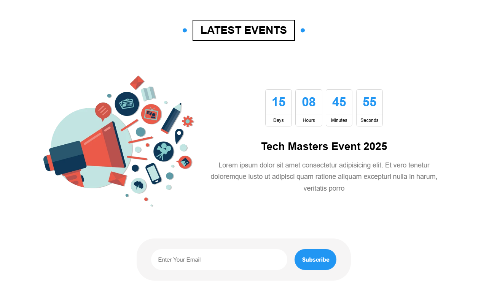
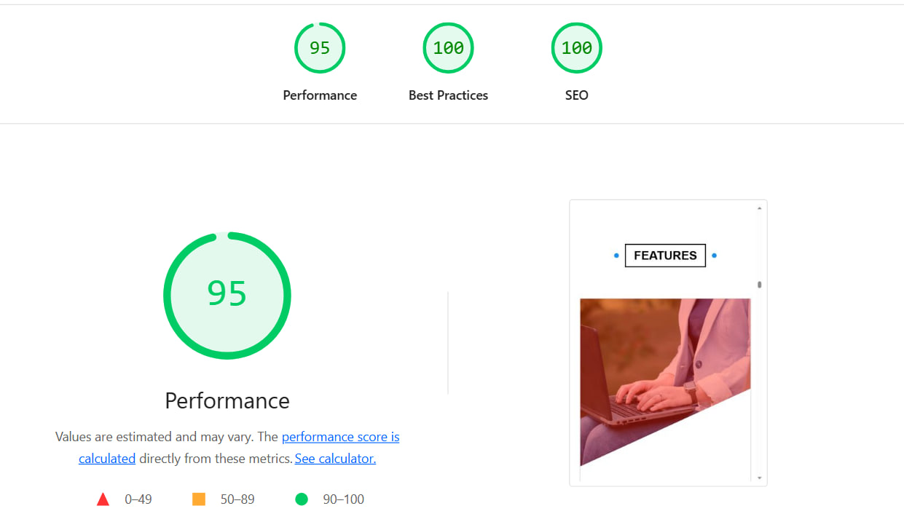

# 🌐 HTML CSS Template 03

This project is a modern responsive landing page built entirely with HTML and CSS. It includes animated sections, flexible layouts using CSS Grid and Flexbox, and is mobile-friendly. Designed for portfolios, business sites, or learning purposes.

---

---

# Screenshot

- Articles

- Testimonials

- Skills

Events

- Page Quality

## 🔧 Technologies Used

- **HTML5**
- **CSS3**
- **Flexbox**
- **CSS Grid**
- **CSS Variables**
- **Media Queries**
- **Keyframe Animations**

---

## 🧩 Website Sections

The webpage includes the following styled and animated sections:

- ✅ Testimonials
- ✅ Team Members
- ✅ Services
- ✅ Skills Progress
- ✅ Work Steps
- ✅ Events with Countdown
- ✅ Pricing Plans
- ✅ Videos Section
- ✅ Stats Counter
- ✅ Discount Form Section
- ✅ Footer with Links & Contact Info

---

## 📱 Responsive Design

All components are designed to be responsive on different screen sizes:

- `@media` queries are used to ensure adaptability on mobile and tablets.
- Flexbox and Grid systems are used efficiently for layout adjustments.

---

---

## Deploying my project

- [Live Site URL](https://fylo-data-storage-component-five-sigma.vercel.app/)

## Acknowledgments

- I would like to sincerely thank Eng. Osama Mohamed for his valuable support and guidance.
